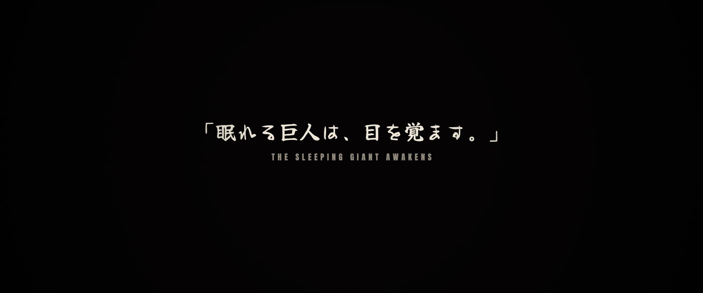
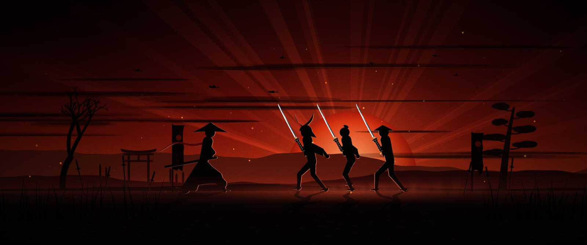
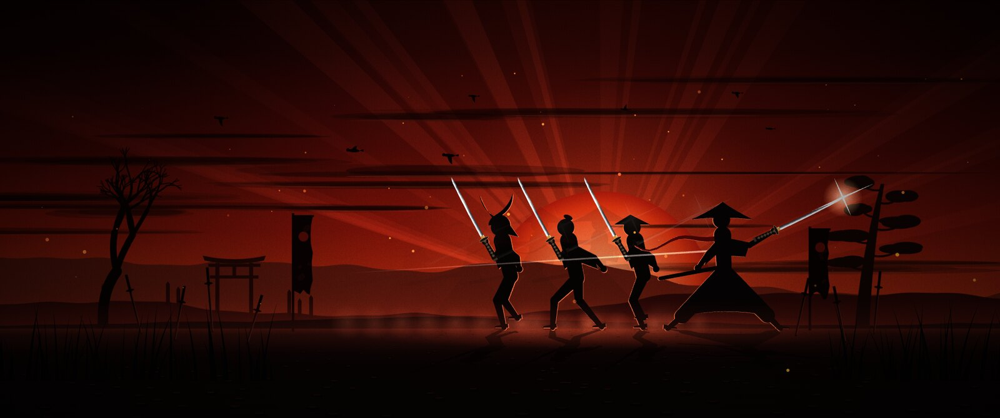
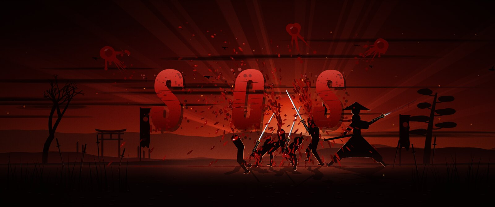
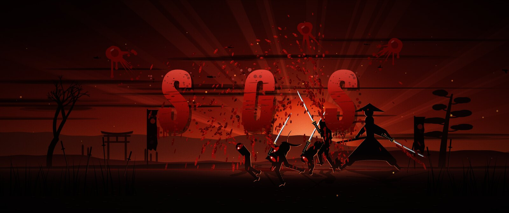
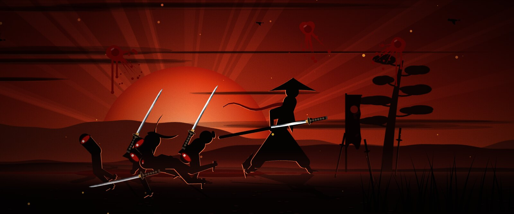
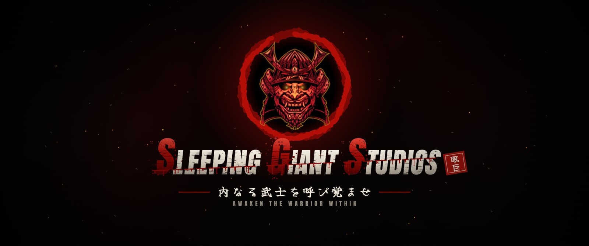

<div align="center">


# Stickman: Ghost Ink

**A first-person hostage-rescue game in the browser, drawn in paper and ink.**
Find the hostage. Get out together.

*A Sleeping Giant Studios game · 内なる武士を呼び覚ませ: awaken the warrior within*

TypeScript · Three.js · Preact · Vite

</div>

## The intro

Every session opens with the studio's ident: a nine-second samurai film drawn live on a canvas, with a score synthesized in the browser. No video files or recordings are used.

<table>
  <tr>
    <td width="50%"></td>
    <td width="50%"></td>
  </tr>
  <tr>
    <td><b>The epigraph.</b> 「眠れる巨人は、目を覚ます。」 The sleeping giant awakens.</td>
    <td><b>The charge.</b> Three swordsmen run at a kneeling samurai across a battlefield of the dead.</td>
  </tr>
  <tr>
    <td></td>
    <td></td>
  </tr>
  <tr>
    <td><b>Iaido.</b> One draw. He is already behind them.</td>
    <td><b>S, G, S.</b> Each kill paints a giant letter in blood.</td>
  </tr>
  <tr>
    <td></td>
    <td></td>
  </tr>
  <tr>
    <td><b>Chiburi.</b> One snap of the blade throws the blood off it.</td>
    <td><b>Noto.</b> He sheathes it slowly, the traditional way, until the guard clicks home.</td>
  </tr>
</table>



## The game

https://github.com/user-attachments/assets/d397e167-213b-419d-9b45-5d0fcb534e4e

https://github.com/user-attachments/assets/72868325-db6f-4837-80ec-334a9c56af82

- **Campaign.** Missions follow one another, each opening on a briefing with its map, objectives and intel. You can also replay missions on their own or play the training level.
- **The compound and the town.** Free the prisoners, defeat the boss Bulky Boy, collect intel and blow the fuel depot. Then escape through the checkpoint.
- **Guards who think.** A yellow **?** gives you three seconds to vanish before it turns into a red **!**. Squads alert each other and flank, and when they run dry they restock at supply crates (so destroy the crates).
- **Hostages who can die.** That includes from your own fire. Lose one and the mission is over.
- **Knife, rifles, a sniper, and frag, smoke and flash grenades.** Blood stays on the floors and walls.
- **A killer7-style look.** Paper-and-ink 3D, manga-noir menus with red neon, and a HUD in greys.
- **Co-op** for up to four players.

## Play it locally

```sh
npm install
npm run dev
```

Open the local Vite address and start the campaign. The controls are in the game menu. Add `?intro=1` to the address to watch the intro again. The character and animation lab is at `/lab.html`.

- `npm run build`: type-check and build for production.
- `npm test`: run all logic checks.

## License

[MIT](LICENSE) covers the source code. The intro's fonts, Anton and Yuji Boku, are under the SIL Open Font License (see `src/brand/fonts/`). The game's audio has separate terms: the Project I.G.I. recordings are not licensed for reuse here. See the [sound credits](public/OST/CREDITS.md).

## Working with coding agents

[AGENTS.md](AGENTS.md) holds the shared project instructions, structure and testing guide. The [browser-check workflow](.agent/skills/browser-check/SKILL.md) covers visual checks of the game and the character lab.

`.agent/` holds repository workflow notes; whether a coding tool finds them automatically depends on the tool. `CLAUDE.md` imports the shared instructions for compatibility. Keep machine-local settings out of Git, and save generated screenshots, recordings and test evidence in the ignored `artifacts/` directory. The README's own images, in `.github/readme/`, are the exception.
